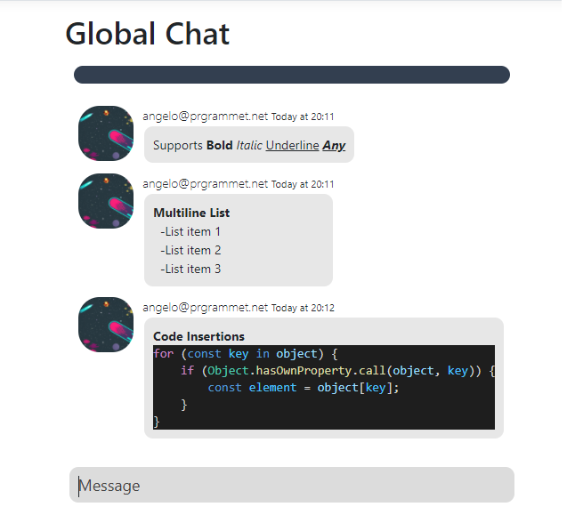

# Project Description
This project contains chat and mail services
- Global Chat
- Grouped Chat
- Batch mailing
- Mail/Newsletter subscriptions 
- Dashboards for managing services

# Global Chat
## Description 
Global chat is dedicated chat open to all account users. It will contain the basic features of a chat application
- Text communication
- Emoji Integration
- Media Uploads
    - Audio (HTML5 audio formats)
    - Video (HTML5 video formats)
    - Image (png, gif, jpg, tiff)
- Prebuilt integrations
    - HTML markup and css integrated layouts
    - Markups linked with injected scripts

Prebuilt integrations will allow certain features to be embedded into the chat that will create a rich dynamic experience and provice rhobust tools to aide in communication, some features pending are:
- Integrated realtime voting system
- Feedback + Q/A scripts for internalized functionality or support services

## Text formatting
Allows input of text, formatted in bold, italic, underline.

## Multi User
Multiple users can communicate in global chat, each live client connection will recieve a message broadcast.
